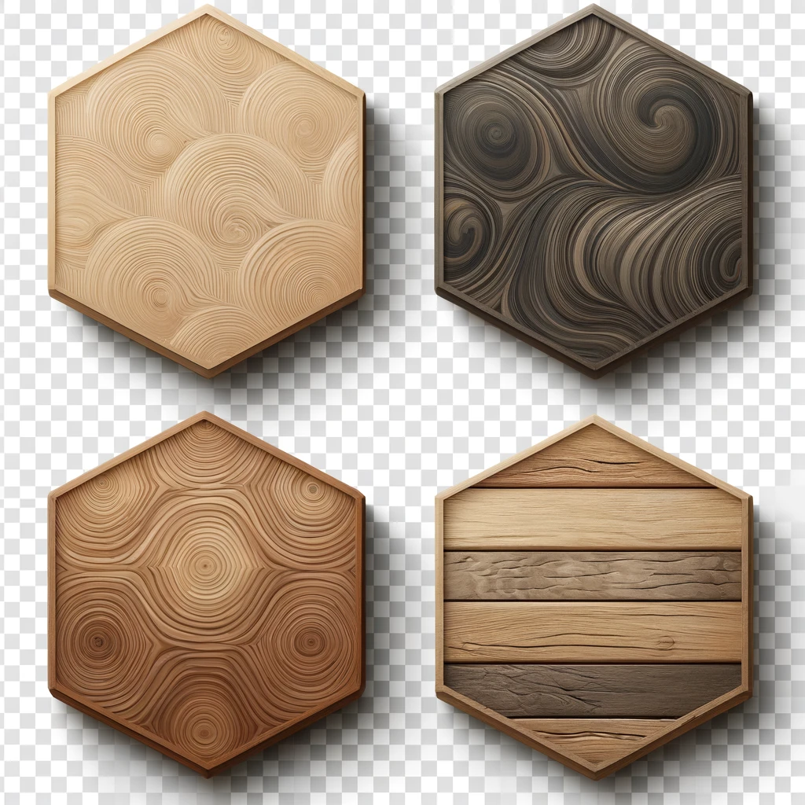
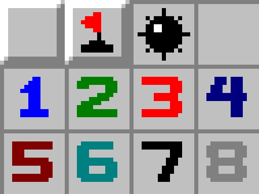
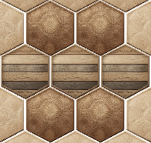
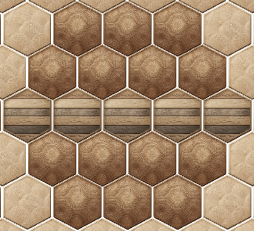
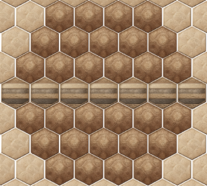

# hexa-gone
CSC452 Project 2.


## Development Notes

### Tiles and Numbers



An enum `TileMode` governs which tiles to display:

- `TileMode.covered` displays `tile_1` (top-left), used for covered tiles (not yet uncovered by player).
- `TileMode.uncovered` displays `tile_3` (bottom-left), used for tiles uncovered by the player (to display either a blank (zero), a number, or a bomb/mine.
- `TileMode.flagged` displays `tile_4` (bottom-right), used to display a tile that the player has flagged.
- `TileMode.outOfBounds` displays `tile_2` (top-right), used to display a tile that is not part of the game (cannot interact with player).



The numbers (1 through 6) and the mine icon are taken from the traditional Minesweeper game design, shown above.

### Determining Board Size

We can define the size of regular, hexagonal boards by their "side lengths" (which is equivalent to the length of their top-most row). For side length $n=1$, this board only comprises one tiles and has size $1$.



For side length $n=2$ (see above), the board has $3+2(2)=7$ tiles.



For side length $n=3$ (see above), the board has $5+2(4+3)=19$ tiles.



For side length $n=4$ (see above), the board has $7+2(6+5+4)=37$ tiles.

Summarizing, we can see that a board of side length $n$ has
```math
2n-1+\frac{(2n-2)(n+(2n-2))}{2} = 2n-1+(n-1)(3n-2) = 3n^2-3n+1
```
tiles.

Here's a brief table of board lengths vs. board sizes:

| Board Length ($n$) | Board Size |
|:-:|:-:|
| 1 | 1 |
| 2 | 7 |
| 3 | 19 |
| 4 | 37 |
| 5 | 61 |
| 6 | 91 |
| 7 | 127 |
| 8 | 169 |
| 9 | 217 |
| 10 | 271 |
| 11 | 331 |
| 12 | 397 |
| 13 | 469 |
| 14 | 547 |
| 15 | 631 |
| 16 | 721 |

### Determining Gamemodes and Difficulty

Regular (classic) minesweeper has the following difficulty categories:

|Name|Dimensions|Size|Mines|Density|
|:-:|:-:|:-:|:-:|:-:|
|Beginner (A)|8x8|64|10|15.625%|
|Beginner (B)|9x9|81|10|12.346%|
|Intermediate|16x16|256|40|15.625%|
|Expert|30x16|480|100|20.833%|

We can use these as starting references for our version of HexaGone.

|Name|Side Length|Size|Mines|Density|
|:-:|:-:|:-:|:-:|:-:|
|Beginner|n=6|91|10|10.989%|